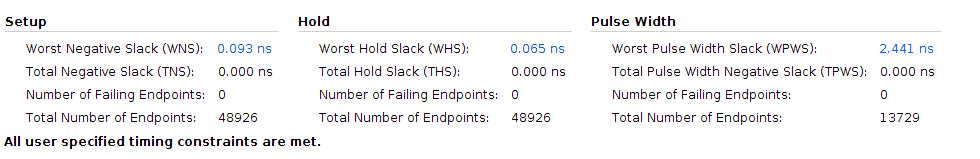
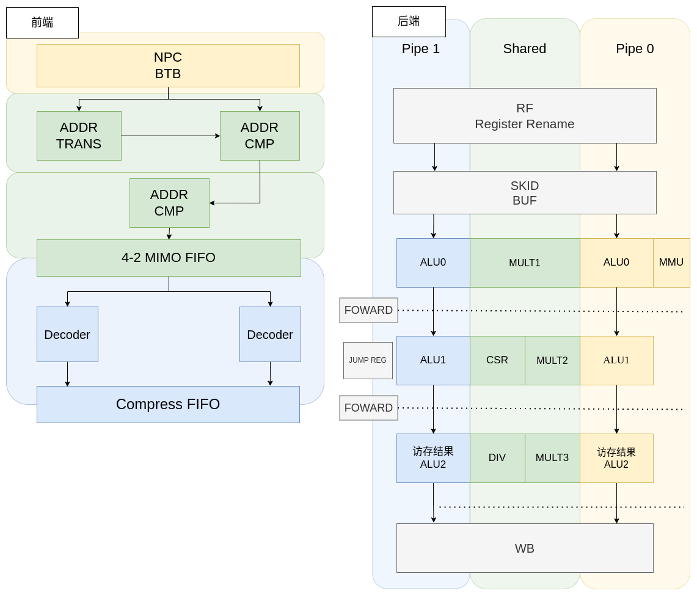

# complex_loong_cpu

NSCSCC 2023 Lain Core项目决赛提交cpu核心。继承自[simple_loong_cpu](https://github.com/LainChip/simple_loong_cpu) lain_backend分支。

核心采用8级流水顺序双发射结构，支持loongarch 32 reduced指令集除浮点指令外所有指令，可正确运行团队赛发布功能测试、性能测试，并能稳定快速启动Linux。

性能测试成绩：主频140MHz，性能分2.919（OpenLA500整体性能加速比），IPC加速比1.047。

项目展示链接：https://www.bilibili.com/video/BV1u94y1r7jo/

## 架构设计

**核心特点**：

- 解码级优化解码器，Spinal编写，QMC优化解码逻辑
- 发射级使用分bank寄存器堆，简化设计复杂度
- 发射级寄存器重命名，简化前递比较逻辑和发射逻辑
- 发射级与执行级间插入skid buf，截断关键路径
- ALU可拆卸，自由配置，增加执行机会的同时尽可能降低逻辑延迟
- 后端前递数据通路可灵活配置，非全力前递，权衡兼顾性能和延迟
- FPGA层次上的优化

## 目录结构

- rtl：项目rtl代码
  - utils：工具类模块
  - 相比于simple_loong_cpu，各模块放置扁平化
- src：项目工具代码
  - simple-decoder：Spinal实现的解码器
  - 其余部分与simple_loong_cpu类似
- bin / bits / docs ...

## 构建与仿真

见 [simple_loong_cpu](https://github.com/LainChip/simple_loong_cpu)

## 开发工具

本项目使用chiplab辅助开发，其使用Verilator进行仿真验证，较为方便。Synopsys VCS仿真在访存方面具有更高的准确性，也曾用于本项目的调试。

- IDE :  Xilinx Vivado 2019.2 / 2022.2
- Simulator :  Verilator 5.004, [chiplab](https://gitee.com/loongson-edu/chiplab), Synopsys VCS-MX 2018.09
- Toolchain :  la32r-toolchains

## 参考资料

- 《超标量处理器设计》 姚永斌
- 《LA32R 龙芯架构32位精简版参考手册》
- [pulp-platform](https://github.com/pulp-platform)：通用模块[common_cell](https://github.com/pulp-platform/common_cells)和AXI接口包装[axi](https://github.com/pulp-platform/axi)
- [VexRiscV](https://github.com/SpinalHDL/VexRiscv)：解码器参考

